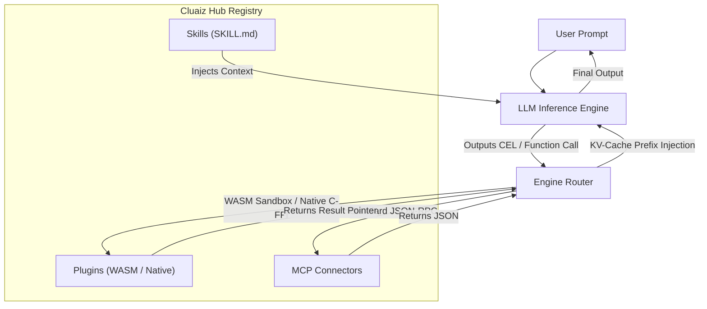

<p align="center">
  
</p>

<h1 align="center">Cluaiz Hub</h1>

<p align="center">
  <strong>The Official Central Registry for Cluaiz Plugins, Skills, Souls, & MCP.</strong>
</p>

<p align="center">
  <a href="https://github.com/cluaiz/skills/actions"></a>
  <a href="LICENSE"></a>
</p>

---

## 🌟 What is this?

This repository (**Cluaiz Hub**) is the central registry for the Cluaiz Inference Engine. It contains everything needed to extend the core engine's capabilities, give the AI new knowledge, and execute high-performance tools.

---

## 🏗️ Core Pillars of the Cluaiz Ecosystem

### 1. 🔌 Plugins (The Execution Muscle)
A **Plugin** provides direct in-memory execution power. Plugins can be compiled as:
- **WASM Micro-Tools (`WASM`):** Fully isolated with strict CPU fuel limits and RAM caps.
- **Native Plugins (`NATIVE`):** Bare-metal C-FFI binaries (`.dll`, `.so`, `.dylib`) for deep VRAM access, database storage, and high-speed web retrieval.
- **Example:** `cluaiz-search` (Live web metasearch), `cluaiz-db` (Neural database), `cluaiz-math` (WASM calculator).

### 2. 🧠 Skills (The AI Instructions)
A **Skill** is pure workflow and context formatting (`SKILL.md`). It teaches the AI *how* and *when* to reason and call tools without containing binary code.
- **Example:** `frontend-dev` (Guides code generation conventions).

### 3. 🌐 MCP (Model Context Protocol)
Open standard external tools. Bridges external subprocesses (such as GitHub, PostgreSQL, or Brave Search) to the Cluaiz Engine over standardized JSON-RPC stdio/HTTP transports.

---

## 🔄 End-to-End Execution Flow



---

## 🚀 Quick Start (CLI)

Install any module from the Hub directly via the Cluaiz CLI:

```bash
# Install a Plugin (WASM or Native)
cluaiz plugin install cluaiz-search

# Install a standalone Skill
cluaiz skill install frontend-dev

# Install an MCP Server
cluaiz mcp install github
```
