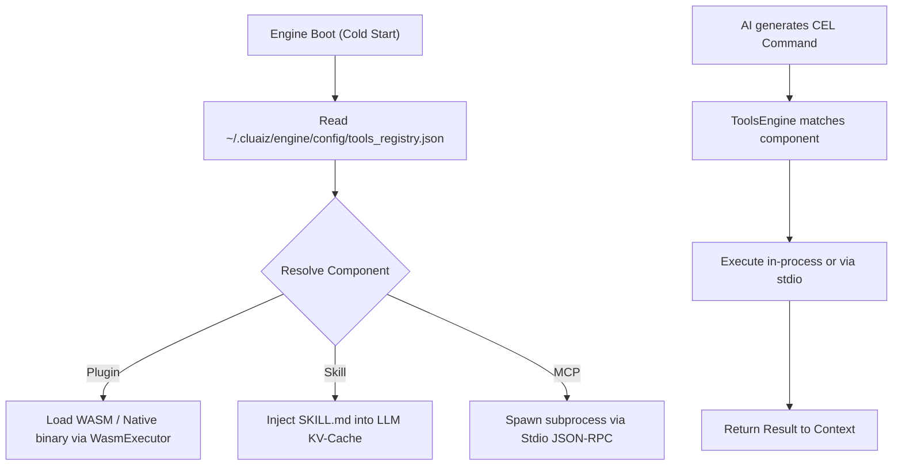

# Two-Tier Tool Architecture: Registry and Package Specification

## 1. Architectural Deep Dive

This document explains the Two-Tier Registry Architecture governing how the Cluaiz Engine discovers, indexes, and executes plugins, skills, and MCP servers without O(N) directory scanning during boot.

---

## 2. Architectural Flow

The engine uses a clean separation of concerns between **Cloud Distribution Indexing** (`package.json`) and **Local Registry State** (`tools_registry.json`).



---

## 3. The Package Distribution Standard (`package.json`)
**Source of Truth:** `package.json` inside each component directory.

Each component declares its identity, dependencies (transitive skills/plugins/MCPs), and release binaries:

```json
{
  "id": "cluaiz-search",
  "name": "Cluaiz Web Search",
  "category": "research",
  "hub_type": "plugin",
  "build_type": "binary",
  "latest_version": "0.1.1",
  "dependencies": {
    "plugins": {},
    "mcp": {},
    "skills": {}
  },
  "versions": {
    "0.1.1": {
      "updated_at": "2026-07-01T15:59:00Z",
      "os": {
        "windows": "https://github.com/.../cluaiz-search_windows_x64.dll",
        "linux": "https://github.com/.../libcluaiz-search_linux_x64.so"
      },
      "files": {
        "skill": "/SKILL.md",
        "file_directory": "https://github.com/.../cluaiz-search-files.zip"
      }
    }
  }
}
```

---

## 4. Local Installation Index (`tools_registry.json`)
**Location:** `~/.cluaiz/engine/config/tools_registry.json`

Tracks the installed tools on the local node:

```json
{
  "installed_tools": {
    "cluaiz-search": {
      "id": "cluaiz-search",
      "name": "cluaiz-search",
      "category": "plugin",
      "local_dir": "~/.cluaiz/tools/plugins/cluaiz-search",
      "enabled": true,
      "execution_mode": "auto"
    }
  }
}
```
