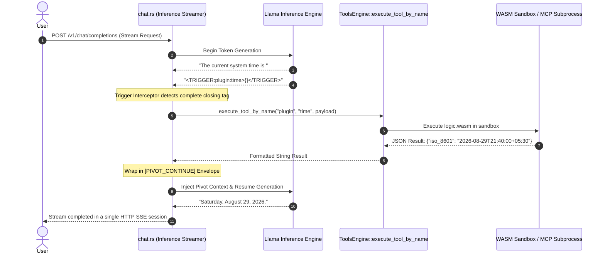

# 🔄 Single-Pass Tool Interception & Turn Lifecycle

This document explains the **Single-Pass Tool Interception Engine** and the **Session Turn Lifecycle** in Cluaiz, contrasting it with traditional multi-round LLM tool-calling models.

---

## ⚡ 1. The Single-Pass Paradigm vs Traditional Multi-Round Tool Calling

Traditional AI frameworks (e.g. OpenAI function calling, standard ReAct agents) require multiple independent roundtrips to the server to execute a tool:

```
Traditional Flow (Slow & Wasteful):
User Query ──> Server (Round 1) ──> Emits JSON Tool Call ──> Client Executes ──> Server (Round 2) ──> Final Response
Total Latency: 2-3x network overhead + full context re-evaluation.
```

**Cluaiz Single-Pass Stream Interception (In-Process & Instant):**

```
Cluaiz Flow (Single-Pass & Mid-Stream):
User Query ──> Engine Streams Tokens ──> Encounters <TRIGGER:...> ──> In-Process WASM / Subprocess Executed ──> Resumes Streaming
Total Latency: ~1ms tool overhead + ZERO extra network roundtrips.
```

---

## 🔍 2. Mid-Stream Trigger Interception Sequence



---

## 🎯 3. The Pivot Envelope (`[PIVOT_CONTINUE]`)

When a tool finishes execution mid-stream, `chat.rs` formats the result into a clean pivot continuation envelope before resuming LLM decoding:

```text
[PIVOT_CONTINUE]
Tool: time
Execution Envelope: WASM (in-process)
Result: {"iso_8601": "2026-08-29T21:40:00+05:30", "day_of_week": "Saturday", "utc_offset": "+05:30"}
[RESUME_GENERATION]
```

This ensures the LLM seamlessly absorbs the tool output into its current attention context without hallucinating synthetic responses or breaking token streaming.

---

## ⏳ 4. Session Tool Lifecycle & Turn Engine

Tools attached to a session are managed dynamically by `TurnLifecycleEngine` (`engines/src/tools/lifecycle/turn_engine.rs`):

### Execution Modes:
1. **Auto (`execution_mode: auto`):**
   - Activated automatically by semantic keyword matches.
   - Typically configured with `default_turns: 1` or `default_turns: 2`.
2. **Manual (`execution_mode: manual`):**
   - Explicitly bound by user command or client attachment.
   - Remains active for a configured turn count or indefinitely (`default_turns: -1`).

### Turn Decrementing & Expiration:
```
User Prompt (Turn 1) ──> Tool Active (turns_remaining: 2) ──> Output Generated ──> turns_remaining: 1
User Prompt (Turn 2) ──> Tool Active (turns_remaining: 1) ──> Output Generated ──> turns_remaining: 0
User Prompt (Turn 3) ──> Tool Expired! Auto-purged from session context ──> VRAM/KV-Cache instantly reclaimed.
```
