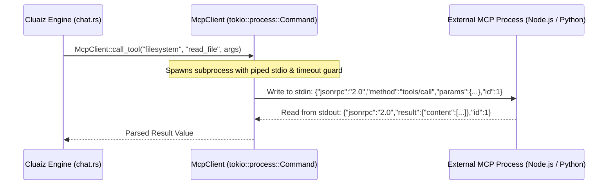

# 🔌 Model Context Protocol (MCP) in Cluaiz

The **Model Context Protocol (MCP)** is an open industry standard that allows AI engines to communicate with external tools, services, and environments.

In Cluaiz, MCP servers run as **isolated local subprocesses** communicating with the Inference Engine over Standard Input/Output (stdio) using JSON-RPC 2.0.

---

## 🏗️ 1. Cluaiz Local MCP Architecture

While cloud-based AI engines require OAuth handoffs and remote network endpoints, Cluaiz prioritizes **Local Sovereign Execution**:

```
"Your MCP servers run locally on your machine. Zero OAuth handoffs, zero data leaving the box."
```



---

## 🛡️ 2. Security & Process Isolation

1. **Explicit Whitelisting:** External commands (`command: "npx"`, `args: [...]`) must be explicitly declared in `package.json`.
2. **Timeout Guards:** Every stdio read is guarded by an asynchronous timeout guard (`tokio::time::timeout`).
3. **No Ambient Host Authority:** MCP processes run in their own process sandbox with standard OS user-level permissions.
