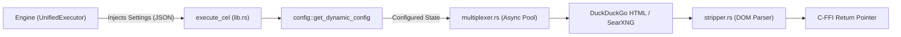

# Component: cluaiz-search

## Technical Specification
- **Purpose:** A native `cdylib` plugin that provides open-source web metasearch (DuckDuckGo/SearXNG) and HTML DOM parsing. It extracts raw text while stripping structural bloat and executes entirely within a secure C-FFI boundary without touching the disk for its configurations.
- **Platform Support:** Windows, Linux, macOS (Hardware-agnostic)
- **Reusability Level:** Native Plugin (Dynamically loaded via Engine's `UnifiedExecutor`)

## Architectural Flow

## API Contract (Interface)
- **Props/Struct/Trait:** `execute_cel` (C-FFI Entry Point), `DynamicConfig` (Payload State)
- **Export Type:** `C-FFI` (`extern "C"`)
- **Dependencies:** `reqwest` (HTTP), `tokio` (Async runtime), `scraper` (HTML parsing), `serde_json` (Payload mapping)

## Deep File Breakdown
- `src/lib.rs`:
  - **Logic:** `execute_cel` acts as the native C-ABI gateway.
  - **Flow:** Receives `*const c_char`, deserializes it into `serde_json::Value`, invokes `get_dynamic_config`, and spawns the blocking Tokio thread for search execution.
  - **Why:** To safely cross the FFI boundary and decouple async networking from the Engine's main execution loop.

- `src/config.rs`:
  - **Logic:** Extracts runtime configurations (`search_api_key`, `think_mode`).
  - **Flow:** Reads strictly from the injected `serde_json::Value` payload. No disk traversal or IPC file-system access occurs.
  - **Why:** Enforces strict sandbox isolation; plugins are prohibited from reading Engine manifest files directly from the disk.

- `src/search_engine/multiplexer.rs`:
  - **Logic:** Concurrent API fetching and routing.
  - **Flow:** Consumes the `DynamicConfig` and fires asynchronous GET requests to primary metasearch nodes.
  - **Why:** To minimize network latency by racing multiple open-source endpoints simultaneously.

- `src/parser/stripper.rs`:
  - **Logic:** Raw text extraction from HTML responses.
  - **Flow:** Uses the `scraper` crate to traverse the DOM, retaining only semantic nodes (`
`, `<h1>`-`<h6>`) while aggressively dropping `<script>`, `<style>`, and layout bloat.
  - **Why:** Prevents VRAM exhaustion and context-window overflow during AI generation by discarding boilerplate before returning data to the Engine.

## Failure & Recovery Logic
- **Potential Failure Point:** Network timeout or mirror rate-limiting (HTTP 429).
- **Recovery Logic:** `rotator.rs` catches the error and executes fallback to secondary mirrors (e.g., swapping to DuckDuckGo if SearXNG fails). If all mirrors exhaust, it returns a structured JSON error `{"status": "error"}` across the FFI boundary instead of panicking.
- **Potential Failure Point:** Memory overflow during massive DOM parsing.
- **Recovery Logic:** `stripper.rs` implements byte-level truncation, halting extraction if the document exceeds the predefined buffer limit.
